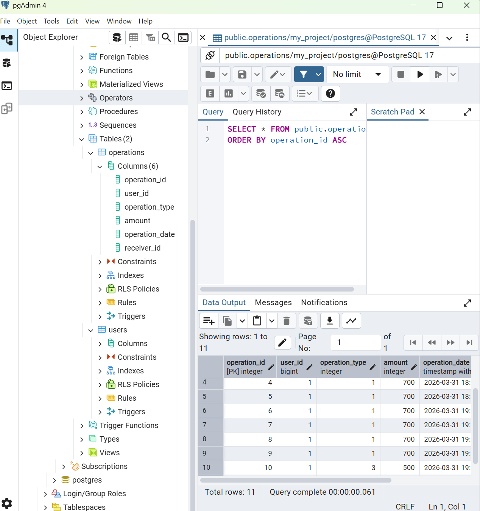

# Проект: Банковский API (PJ-04)

RESTful сервис на Java и Spring Boot для управления банковскими операциями.

## Ссылка на работающий сервис (Render)
https://bankproject-l3s1.onrender.com

## Основной функционал:
1. Проверка баланса: получение текущего счета пользователя по ID.
2. Пополнение и снятие средств: изменение баланса с записью в историю операций.
3. Переводы: перевод средств между пользователями в рамках одной транзакции (защита данных при сбоях).
4. История операций: получение списка всех действий в формате JSON с возможностью фильтрации по датам.

## Стек технологий:
* Java 17, Spring Boot
* PostgreSQL (база данных)
* Docker (контейнеризация для деплоя)
* JUnit 5 (тестирование логики переводов)

## Примеры запросов:
* GET /api/balance/1 — получить баланс пользователя 1.
* POST /api/put?id=1&amount=1000 — пополнить баланс на 1000.
* POST /api/transfer?from=1&to=2&amount=500 — перевод от пользователя 1 к пользователю 2.
* GET /api/operations?id=1 — история операций пользователя 1.

## Схема базы данных
